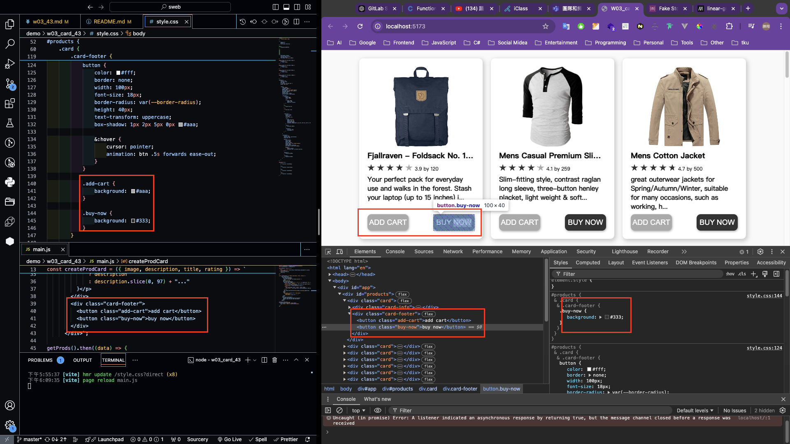
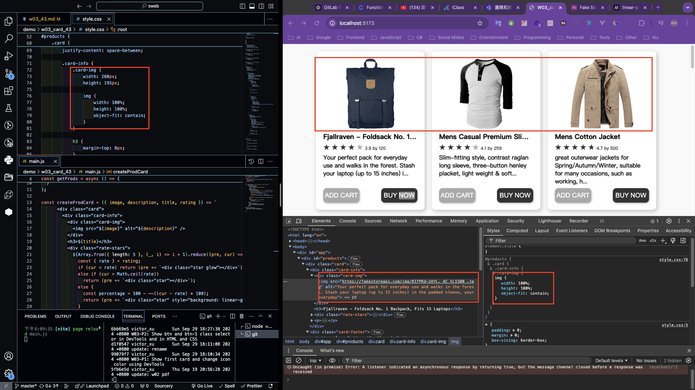

### W03-P1: Show first card and change icon color using DevTools


```
99079f7 victor_xu       Sun Sep 29 18:10:34 2024 +0800  W03-P1: Show first card and change icon color using DevTools
```

### W03-P2: Show btn and btn-1 class selector in DevTools and in HTML and CSS



```
6bb69e5 victor_xu       Sun Sep 29 18:27:38 2024 +0800 W03-P2: Show btn and btn-1 class selector in DevTools and in HTML and CSS
```

### W03-P3: Show 2 photos with the same height, remain photo ration, and show .img class selector



```
5373e38 victor_xu       Sun Sep 29 18:35:33 2024 +0800  W03-P3: Show 2 photos with the same height, remain photo ration, and show .img class selector
```

### W03-P4: git logs for W03

```
5373e38 victor_xu       Sun Sep 29 18:35:33 2024 +0800  W03-P3: Show 2 photos with the same height, remain photo ration, and show .img class selector
6bb69e5 victor_xu       Sun Sep 29 18:27:38 2024 +0800  W03-P2: Show btn and btn-1 class selector in DevTools and in HTML and CSS
d1f0547 victor_xu       Sun Sep 29 18:11:08 2024 +0800  update: rename
99079f7 victor_xu       Sun Sep 29 18:10:34 2024 +0800  W03-P1: Show first card and change icon color using DevTools
```
