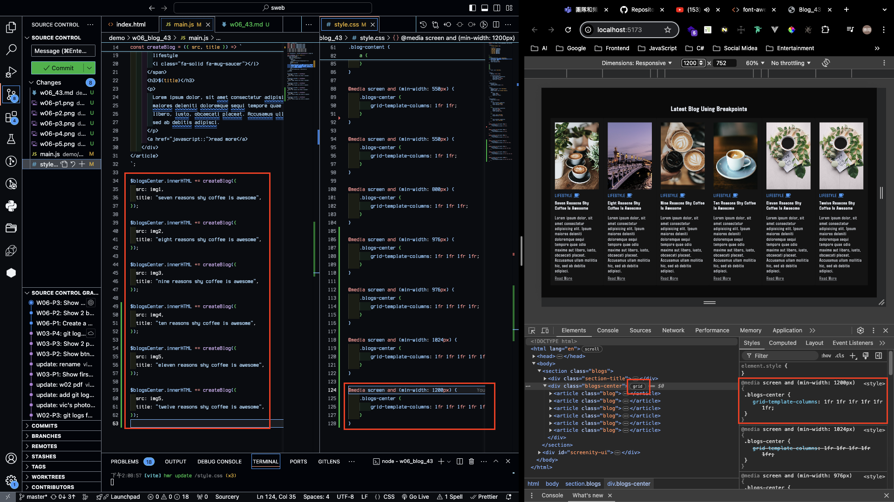

## W06-P1: Create a blog, using html and css as specified


```
e2bf0a7 victor_xu       Sun Oct 20 13:08:48 2024 +0800  W06-P1: Create a blog, using html and css as specified
```

### W06-P2: Show 2 blogs in a row with media query min-width: 550px


```
7457556 victor_xu       Sun Oct 20 13:30:11 2024 +0800  W06-P2: Show 2 blogs with media query min-width: 550px
```

### W06-P3: Show 3 blogs in a row with media query min-width: 800px


```
2e633a7 victor_xu       Sun Oct 20 14:03:03 2024 +0800  W06-P3: Show 3 blogs in a row with media query min-width: 800px
```

### W06-P4: Show 4~6 blogs in a row with media query. You need to determine the min-width for each.

#### => 4 blogs in a row


#### => 5 blogs in a row


#### => 6 blogs in a row



```
68a1032 victor_xu       Sun Oct 20 14:11:41 2024 +0800  W06-P4: Show 4~6 blogs in a row with media query. You need to determine the min-width for each.
```

### W06-P5: git logs of W6


