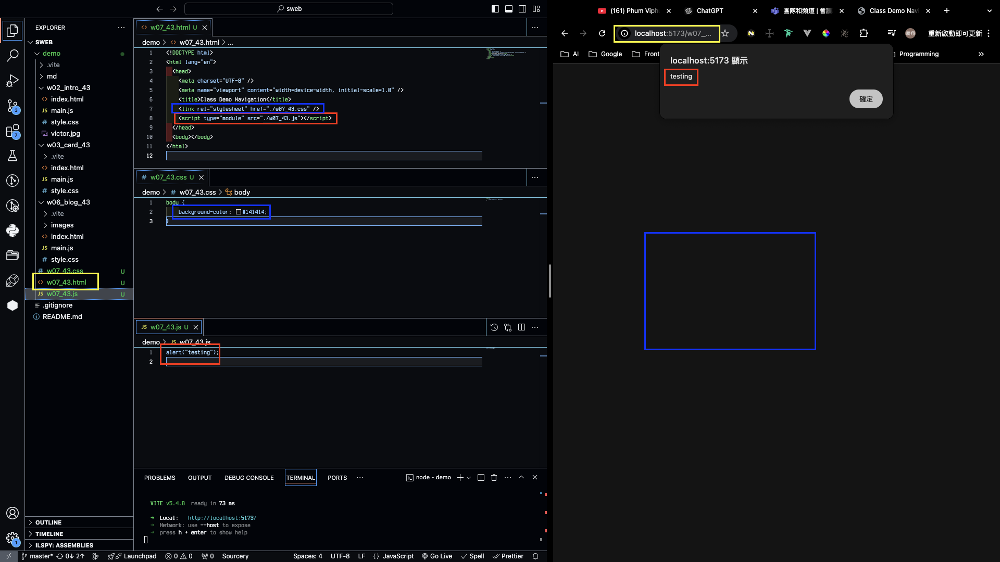

[GitHub URL](https://github.com/vic0627/1131-sweb-demo-43)

## W07-P1: Test css and js for w07_xx.html



```
f111c1b victor_xu       Sat Oct 26 11:19:16 2024 +0800  W07-P1: Test css and js for w07_43.html
```

## W07-P2: Redo W06-P4 with breakpoints being cancelled


```
182ae81 victor_xu       Sat Oct 26 11:31:42 2024 +0800  W07-P2: Redo W06-P4 with breakpoints being cancelled
```

## W07-P3: Connect your Github repo to Vercel and have a root home page to class demo navigation
 
#### => In Vercel, show w06 blogs demo
 

 
#### => Show your Github repo with Vercel URL
 
[My Vercel URL](https://1131-sweb-demo-43.vercel.app/)
 

 
#### => create index.html as root home page and have a link to class demo navigation as done in w07
 

 
```
9e439f5 victor_xu       Sat Oct 26 12:02:46 2024 +0800  W07-P3: Connect your Github repo to Vercel and have a root home page to class demo navigation
```

## W07-P4: Create navbar with links to class demo w02, w03, w06, and deploy it to Vercel
 
#### => local
 

 
#### => Vercel
 

 
```
358be7f victor_xu       Sat Oct 26 12:44:23 2024 +0800  W07-P4: Create navbar with links to class demo w02, w03, w06, and deploy it to Vercel
```