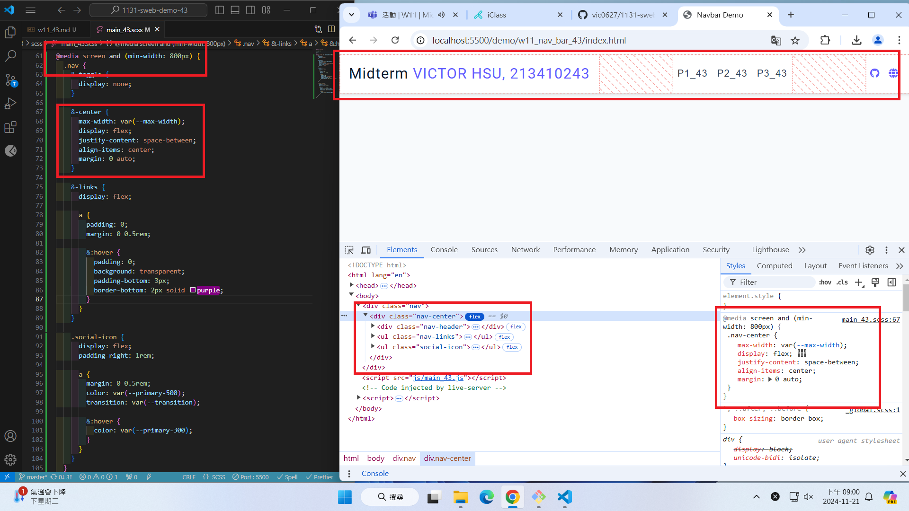

[GitHub URL](https://github.com/vic0627/1131-sweb-demo-43)

[Vercel URL]("https://1131-sweb-demo-43.vercel.app/)

### W11-P1: Create html code for navbar


```
fa2e7de VICTOR_HSU      Thu Nov 21 20:01:39 2024 +0800  W11-P1: Create html code for navbar
```

### W11-P2: Use sass to convert scss/main_43.scss to css/main_43.css


```
620c74d VICTOR_HSU      Thu Nov 21 20:02:05 2024 +0800  ### W11-P2: Use sass to convert scss/main_43.scss to css/main_43.css
```

### W11-P3: sass for small screen


```
9d165d3 VICTOR_HSU      Thu Nov 21 20:29:11 2024 +0800  W11-P3: sass for small screen
```

### W11-P4: css for larger screen



```
fe89910 VICTOR_HSU      Thu Nov 21 21:02:09 2024 +0800  W11-P4: css for larger screen
```

### W11-P5: git logs for W11


