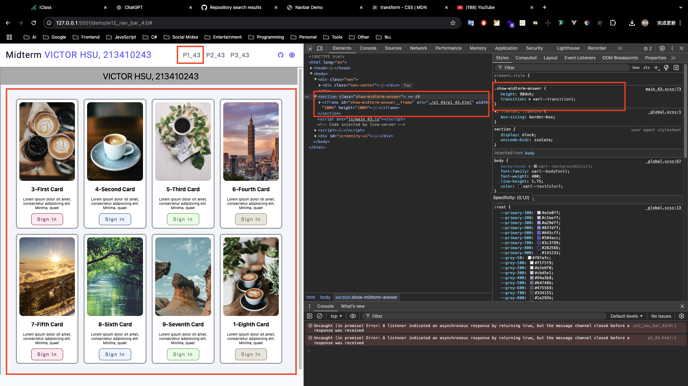
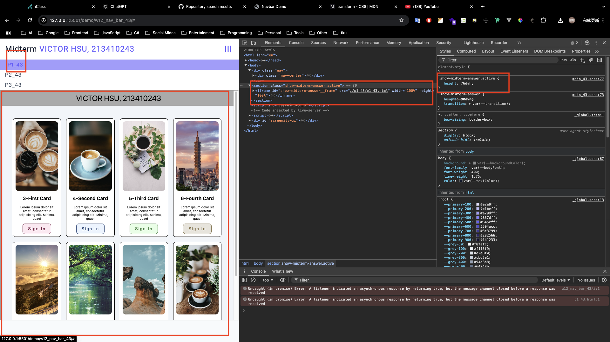
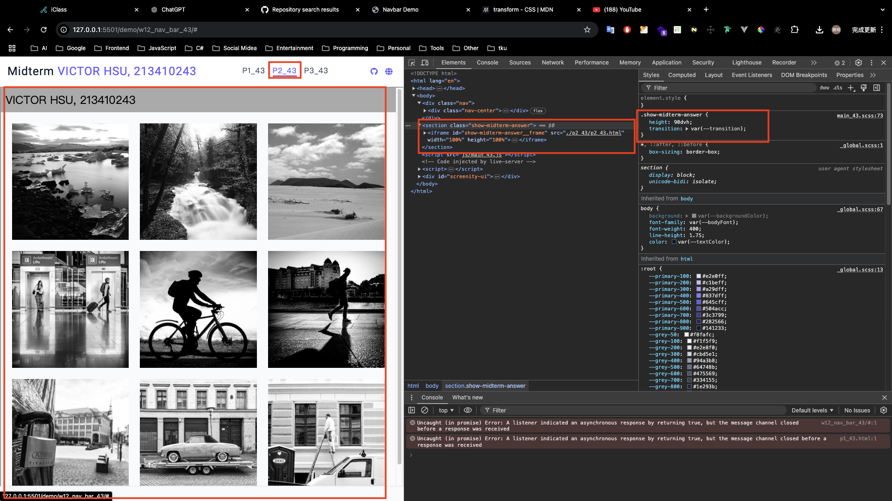
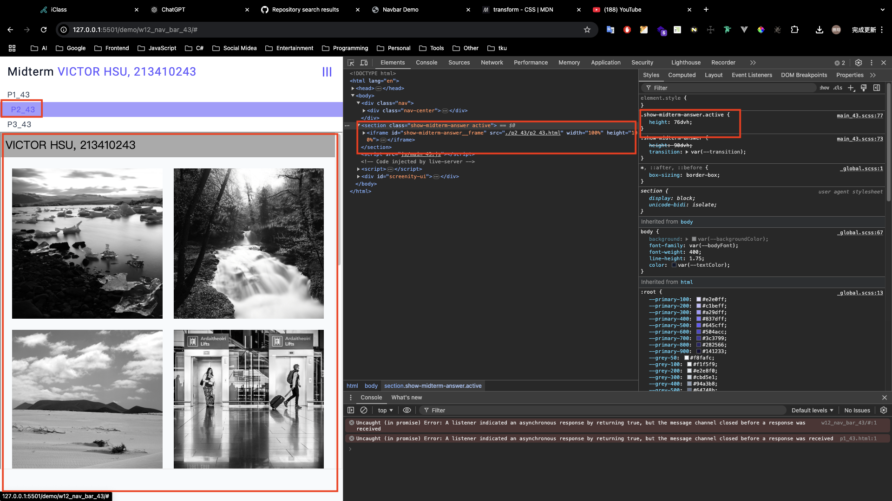
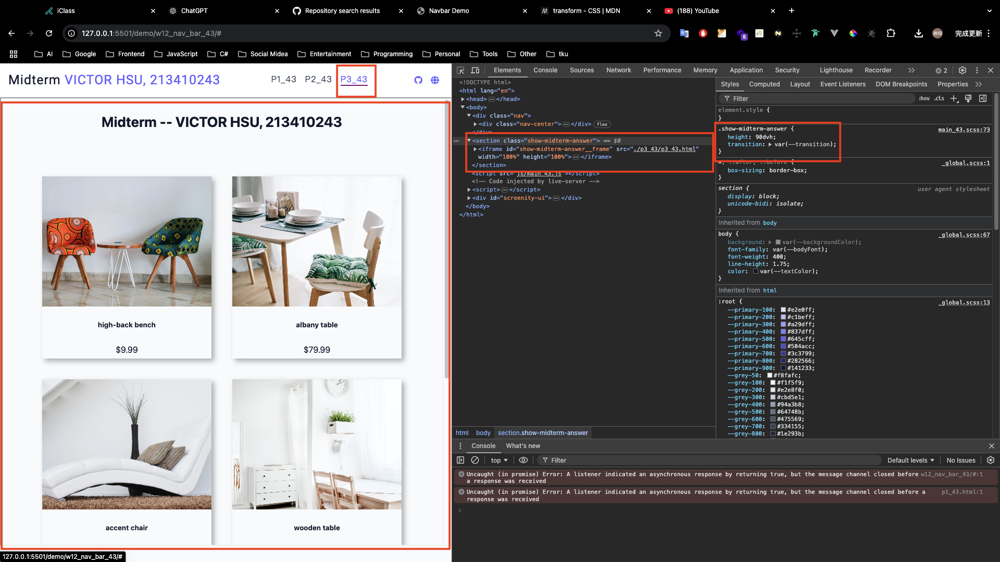
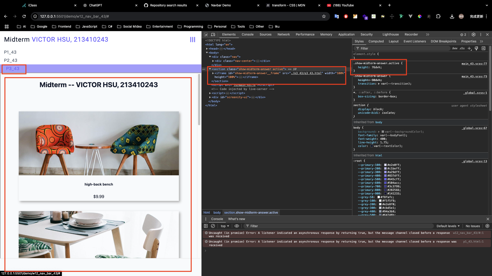
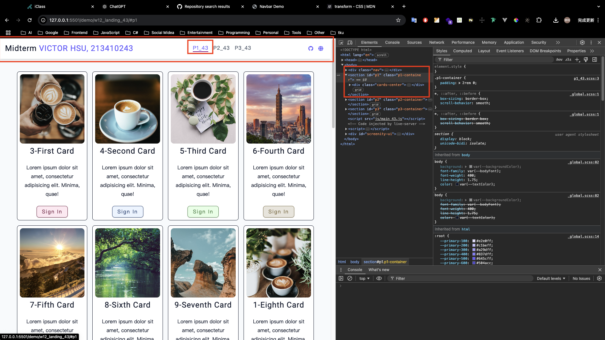
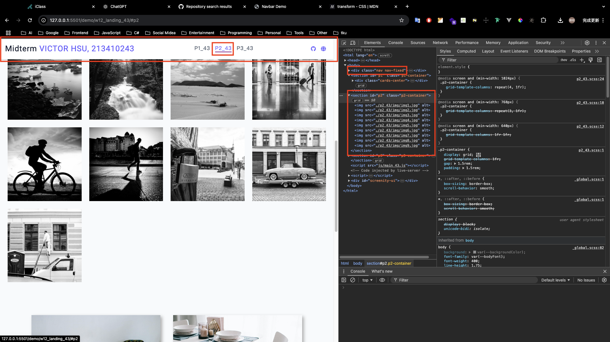

[GitHub URL](https://github.com/vic0627/1131-sweb-demo-43)

[Vercel URL]("https://1131-sweb-demo-43.vercel.app/)

### W12-P1: Show answer of p1_43, p2_43, p3_43 in midterm exam

#### => show p1_43





#### => show p2_43





#### => show p3_43





```
50696d5 victor_xu       Sat Nov 30 15:32:51 2024 +0800  W12-P1: Show answer of p1_43, p2_43, p3_43 in midterm exam
```

### W12-P2: Embed p1_43, p2_43, p3_43 content into index.html, and make it to work correctly

#### => select p3_43 nav link, navbar-fixed will be displayed



#### => select p1_43 nav link, navbar-fixed will be removed


#### => select p2_43 nav link, navbar-fixed will be displayed



```
2b057a9 victor_xu       Sat Nov 30 15:33:39 2024 +0800  W12-P2: Embed p1_43, p2_43, p3_43 content into index.html, and make it to work correctly
```

### W12-P3: git logs for W12

```
2b057a9 victor_xu       Sat Nov 30 15:33:39 2024 +0800  W12-P2: Embed p1_43, p2_43, p3_43 content into index.html, and make it to work correctly
50696d5 victor_xu       Sat Nov 30 15:32:51 2024 +0800  W12-P1: Show answer of p1_43, p2_43, p3_43 in midterm exam
```
