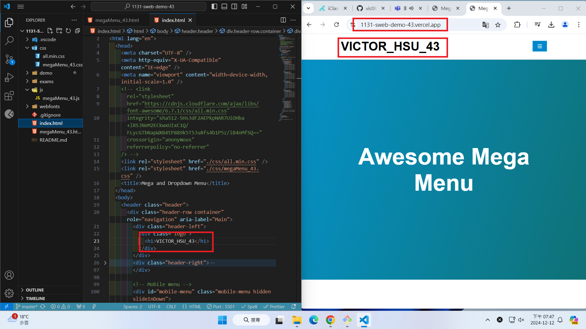
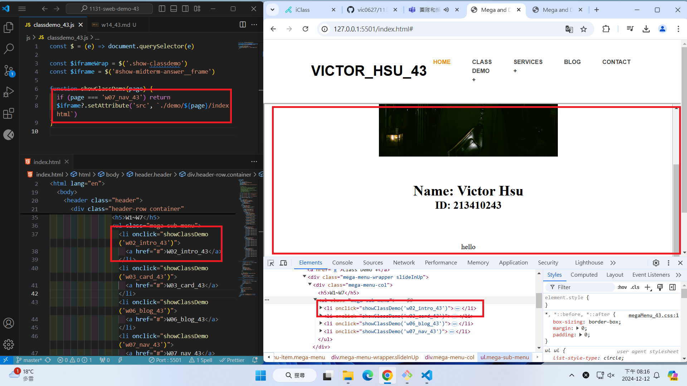

[GitHub URL](https://github.com/vic0627/1131-sweb-demo-43)

[Vercel URL](https://1131-sweb-demo-43.vercel.app/)

### W14-P1: Setup mega menu to replace index.html in the home directory

#### => Show in local


#### => Show in Vercel



```
2c784f6 VICTOR_HSU      Thu Dec 12 19:45:44 2024 +0800  W14-P1: Setup mega menu to replace index.html in the home directory
```

### W14-P2: Show class demo of w2, w3, w6 in both local and Vercel

#### => Show in local for w2



#### => Show in local for w3


#### => Show in Vercel for w6


```
9ece8db VICTOR_HSU      Thu Dec 12 20:10:58 2024 +0800  W14-P2: Show class demo of w2, w3, w6 in both local and Vercel
```

### W14-P3: Add TicTacToe Multipage

#### => Show in local


#### => Show in Vercel


```
fb29484 VICTOR_HSU      Thu Dec 12 20:44:04 2024 +0800  W14-P3: Add TicTacToe Multipage
```

### W14-P4: git logs for W14

```
fb29484 VICTOR_HSU      Thu Dec 12 20:44:04 2024 +0800  W14-P3: Add TicTacToe Multipage
9ece8db VICTOR_HSU      Thu Dec 12 20:10:58 2024 +0800  W14-P2: Show class demo of w2, w3, w6 in both local and Vercel
2c784f6 VICTOR_HSU      Thu Dec 12 19:45:44 2024 +0800  W14-P1: Setup mega menu to replace index.html in the home directory
```
